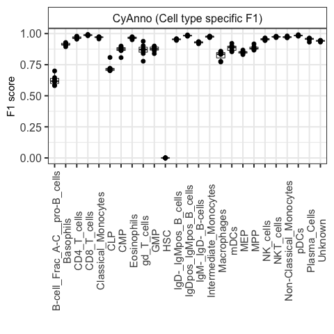

# CyAnnoSamusik
The code includes the R script to download and process the Samusik dataset in a format required by CyAnno. 
For executing R script, [dplyr](https://cran.r-project.org/web/packages/dplyr/index.html) and [HDCytoData](http://bioconductor.org/packages/release/data/experiment/html/HDCytoData.html) are required

```
git clone https://github.com/abbioinfo/CyAnnoSamusik.git
cd CyAnnoSamusik
Rscript Process.R
python CyAnno.py
Rscript plotsamusik.R PATH_TO_SAMUSIK_OUPUT_DIRECTORY
```
The last Rscript will plot the F1 table (observed label vs expected labels) per sample and cell type. The plot must look like this 



# Cite
If you use CyAnno for your research. Please [cite](https://www.biorxiv.org/content/10.1101/2020.08.28.272559v1)

```
CyAnno: A semi-automated approach for cell type annotation of mass cytometry datasets
Abhinav Kaushik, Diane Dunham, Ziyuan He, Monali Manohar, Manisha Desai, Kari C Nadeau, Sandra Andorf

bioRxiv 2020.08.28.272559; doi: https://doi.org/10.1101/2020.08.28.272559 
```
